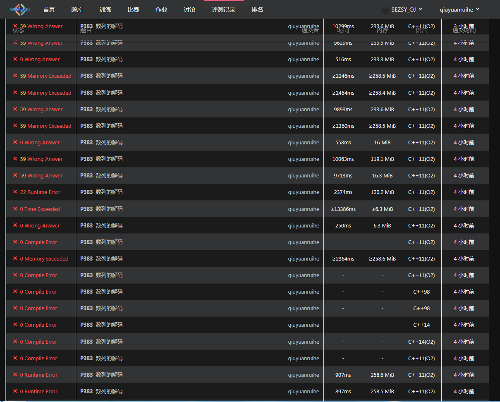

# 2024-03-07日记
~~GitHub真卡~~
***
## 尝试很久的一道神奇的[题目](https://sezsyoj.fun/p/383)

其实题不难，可以当一道`模拟`写。最开始的实现方法如下：
```c++
#include<iostream>
#include<string>
#include<cstring>
#include<algorithm>
#include<cstdio>
#include<cmath>
#include<vector>
using namespace std;
int after_length;
int temp,list_counter;
vector <int> after_list;
int main(){
    cin>>after_length;
    for(int i=0;i<after_length;i++){
        cin>>temp;
        after_list.push_back(temp);
    }
    for(int i=0;i<after_list.size();i++){
        if(after_list[i]==-1){
            list_counter++;
        }
    }

    int lists[list_counter+1][after_length+1];
    int present_list_index=0,array_length;
    bool is_list_full[list_counter];
    memset(is_list_full,0,sizeof(bool)*list_counter);
    //Array lists' first element is the length of this.
    for(int i=0;i<list_counter;i++){
        lists[i][0]=1;
    }
    
    //Decode the list.
    for(int i=0;i<after_list.size();i++,present_list_index++){
        if(present_list_index==list_counter){
            present_list_index=0;
        }

        if(after_list[i]!=-1){
            if(!is_list_full[present_list_index]){
                array_length=lists[present_list_index][0];
                // cout<<array_length;
                lists[present_list_index][array_length]=after_list[i];
                lists[present_list_index][0]++;
            }
            else{
                //Get next list which is not full.
                while(is_list_full[present_list_index]){
                    present_list_index++;
                    if(present_list_index==list_counter){
                        present_list_index=0;
                    }
                }

                array_length=lists[present_list_index][0];
                lists[present_list_index][array_length]=after_list[i];
                lists[present_list_index][0]++;
            }
        }
        else{
            if(!is_list_full[present_list_index]){
                is_list_full[present_list_index]=1;
            }
            else{
                while(is_list_full[present_list_index]){
                    present_list_index++;
                    if(present_list_index==list_counter){
                        present_list_index=0;
                    }
                }
                is_list_full[present_list_index]=1;
            }
        }
    }

    //Output
    cout<<list_counter<<endl;
    for(int i=0;i<list_counter;i++){
        for(int j=0;j<lists[i][0];j++){
            if(j==0){
                cout<<lists[i][j]-1;
            }
            else{
                cout<<" "<<lists[i][j];
            }
        }
        cout<<endl;
    }
}
```
大致思路就是先统计出解码后有几个list，然后维护了个array来存储每个list是不是结束了。之后用一个二维数组存解码出的结果，每个`list[i][0]`存储当前list的长度+1。

结果RE，报错`Segmentation fault`。最难受的是我所有造的数据全部正常通过，然后我只能用oj一点点定位。



### 定位方法

在代码中添加
```c++
return 0;
```
如果出问题的在下面那么就会报WA，而如果出问题的在上面，报错依旧是RE。

最后定位出问题的地方大概在
```c++
//Array lists' first element is the length of this.
    for(int i=0;i<list_counter;i++){
        lists[i][0]=1;
    }
```
这个for循环中。但这怎么看也不想会有问题的样子，于是又经过一阵摸索发现问题出在`lists`这个二维数组开太大了，于是将定义由
```c++
int lists[list_counter+1][after_length+1];
```
改成了
```c++
int lists[list_counter][after_length/list_counter*200];
```
果然不RE了改WA了。~~Damn it~~
